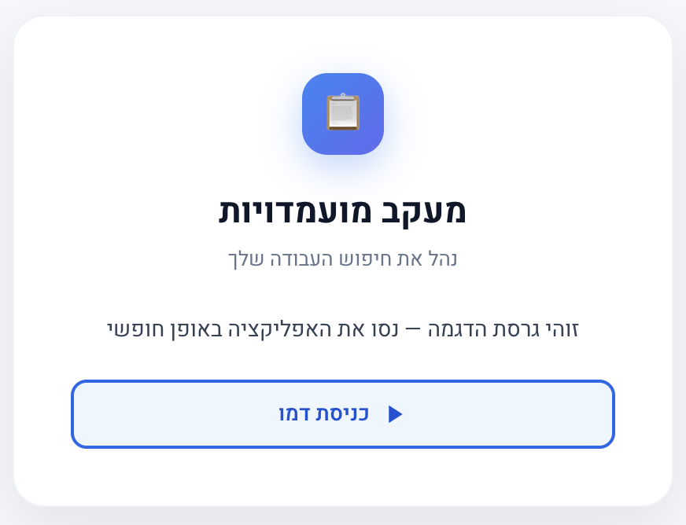
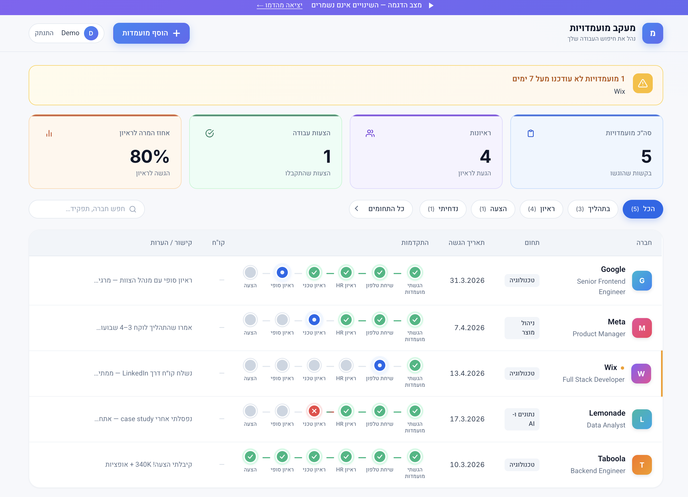
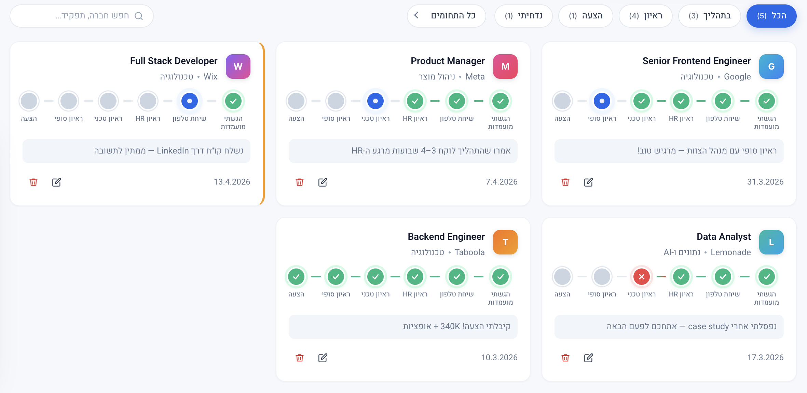
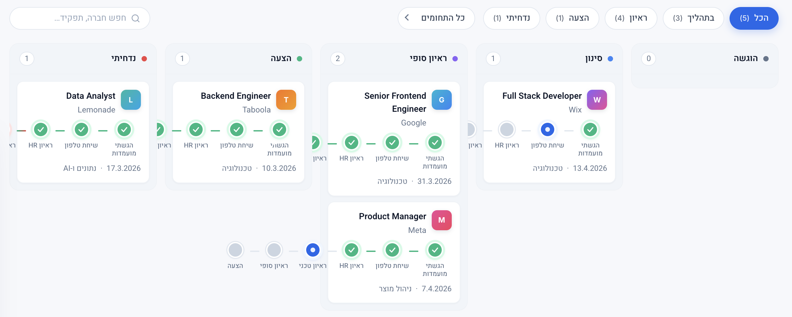
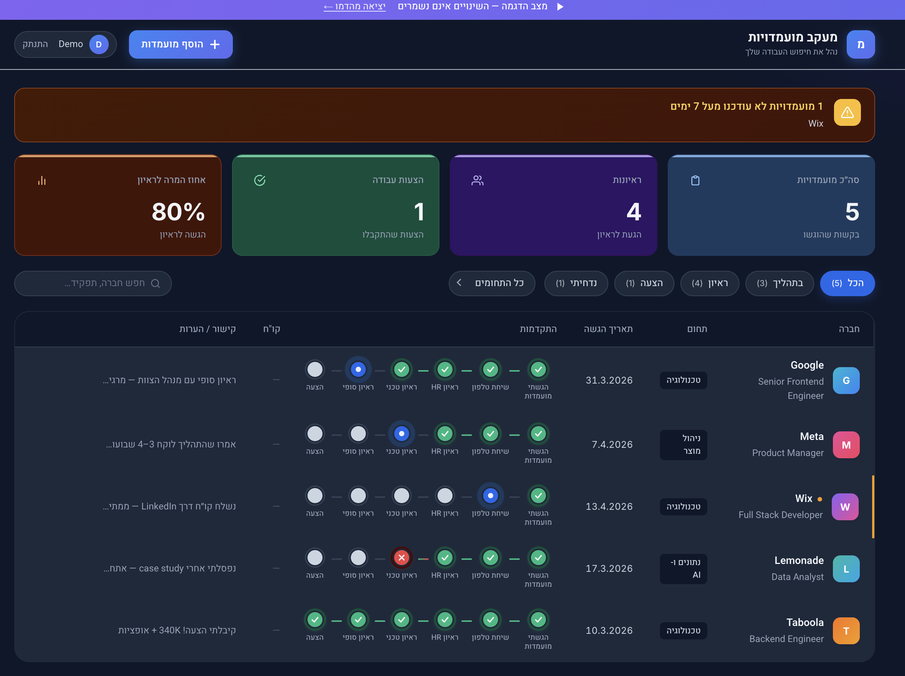
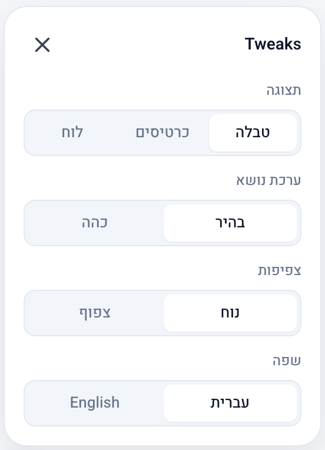

# Job Application Tracker - מעקב מועמדויות

Most job seekers manage their search across spreadsheets, scattered emails, and handwritten notes. Applications get forgotten, follow-ups slip through the cracks, and it is impossible to see the full picture at a glance. This app solves that.

**Job Application Tracker** is a full-stack bilingual web app that gives job seekers one place to track every application, move it through interview stages, and understand what is and is not working in their search.

**[Live Demo - job-tracker-blond-one.vercel.app](https://job-tracker-blond-one.vercel.app)**
No sign-up needed - click the demo button to explore with pre-loaded sample data.

---

## Screenshots

| Landing page | Dashboard |
|---|---|
|  |  |

| Cards view | Kanban board |
|---|---|
|  |  |

| Dark mode | Settings panel |
|---|---|
|  |  |

---

## The Problem

Job searching is a full-time job. At any given time you might have 20 open applications in different stages - some waiting for HR callbacks, some mid-technical-interview, some silently rejected. Without a system, it is easy to:

- Forget to follow up on applications that have gone quiet
- Lose track of which CV version you sent where
- Have no idea what your interview conversion rate actually is
- Miss that a recruiter emailed back three days ago

This app is the system.

---

## Features

### Application Pipeline
- **Visual stage timeline** - each application has a clickable pipeline (Applied, Phone Screen, HR Interview, Technical, Final Interview, Offer). Click any stage to mark it complete, in progress, or failed
- **Custom stages** - add, remove, and rename stages to match any company's hiring process
- **CV per application** - upload a resume PDF to each role so you always know which version you sent

### Dashboard and Insights
- **Stats bar** - live counts for total applications, interviews reached, offers received, and interview-to-application conversion rate
- **Stale application alerts** - a warning banner surfaces any active application not updated in 7 or more days, so nothing goes quiet without you noticing

### Three View Modes
- **Table view** - dense, scannable list with all key info in one row
- **Cards view** - visual grid layout, one card per application
- **Kanban board** - column-based view grouped by pipeline stage (Applied, Screening, Interviewing, Offer, Rejected)

### Personalization
- **Bilingual UI** - full Hebrew (right-to-left) and English (left-to-right) support, switchable at runtime from the settings panel
- **Dark mode** - complete dark theme with adapted colors and gradients
- **Density control** - comfortable and compact row spacing

### Other
- **Search and filter** - instant search by company or role name, filter by status or industry field
- **AI tips** - on-demand analysis of your job search with actionable recommendations

---

## Tech Stack

| Layer | Technology |
|---|---|
| Framework | Next.js 15 (App Router, React 19) |
| Language | TypeScript |
| Styling | Tailwind CSS + custom design token system |
| Auth and Database | Supabase (PostgreSQL, Row Level Security, Storage) |
| AI | Anthropic Claude API |
| Deployment | Vercel |

---

## Getting Started

### Prerequisites

- Node.js 18 or higher
- A [Supabase](https://supabase.com) project
- An [Anthropic](https://console.anthropic.com) API key (optional - only needed for AI tips)

### 1. Clone and install

```bash
git clone https://github.com/rachelyaron/-Job-Application-Tracker.git
cd -Job-Application-Tracker
npm install
```

### 2. Set environment variables

Create a `.env.local` file in the project root:

```env
NEXT_PUBLIC_SUPABASE_URL=your_supabase_project_url
NEXT_PUBLIC_SUPABASE_ANON_KEY=your_supabase_anon_key
ANTHROPIC_API_KEY=your_anthropic_api_key
```

### 3. Set up the database

Run the following SQL in your Supabase SQL editor:

```sql
create table jobs (
  id           uuid primary key default gen_random_uuid(),
  user_id      uuid references auth.users(id) not null,
  company_name text not null,
  role         text not null,
  date_applied date not null,
  field        text,
  stages       jsonb not null default '[]',
  job_link     text,
  cv_url       text,
  notes        text,
  created_at   timestamptz default now(),
  updated_at   timestamptz default now()
);

alter table jobs enable row level security;

create policy "users_select_own" on jobs for select using (auth.uid() = user_id);
create policy "users_insert_own" on jobs for insert with check (auth.uid() = user_id);
create policy "users_update_own" on jobs for update using (auth.uid() = user_id);
create policy "users_delete_own" on jobs for delete using (auth.uid() = user_id);
```

### 4. Run locally

```bash
npm run dev
```

Open [http://localhost:3000](http://localhost:3000) in your browser.

---

## Project Structure

```
app/
  api/
    jobs/          - CRUD endpoints with RLS-scoped Supabase client
    ai-tips/       - Claude-powered job search analysis
    demo/seed/     - Seeds the demo account with sample data
  globals.css      - Design token system and all component styles
  layout.tsx       - Root layout with font loading and SettingsProvider
  page.tsx         - App shell handling auth, demo mode, and view routing

components/
  JobTable.tsx     - Table view
  CardsView.tsx    - Cards grid view
  KanbanView.tsx   - Kanban board view
  JobForm.tsx      - Add and edit modal with stage editor and CV upload
  Timeline.tsx     - Interactive stage pipeline component
  StatsBar.tsx     - KPI cards and stale application banner
  TweaksPanel.tsx  - Floating settings panel (theme, density, view, language)
  AiTips.tsx       - AI analysis modal
  AuthForm.tsx     - Demo entry screen

contexts/
  SettingsContext.tsx  - Global theme, density, language, and view state

lib/
  supabase.ts      - Supabase client factory and domain types
  strings.ts       - i18n strings for Hebrew and English
  utils.ts         - Logo gradients, initials, kanban column mapping
  demo-data.ts     - Static demo jobs for no-auth preview
```

---

## Roadmap

- **Email reminders** - scheduled nudges for applications that have been quiet for too long
- **Application analytics** - charts showing application volume over time, stage drop-off rates, and response rates by industry or company size
- **Resume versioning** - store multiple CV versions and tag which version was sent to each application
- **Import from LinkedIn** - parse exported LinkedIn job application data to populate the tracker automatically

---

## Built by Rachel Yaron

Product-minded developer with a focus on user experience and shipping things that work.

- GitHub: [github.com/rachelyaron](https://github.com/rachelyaron)
